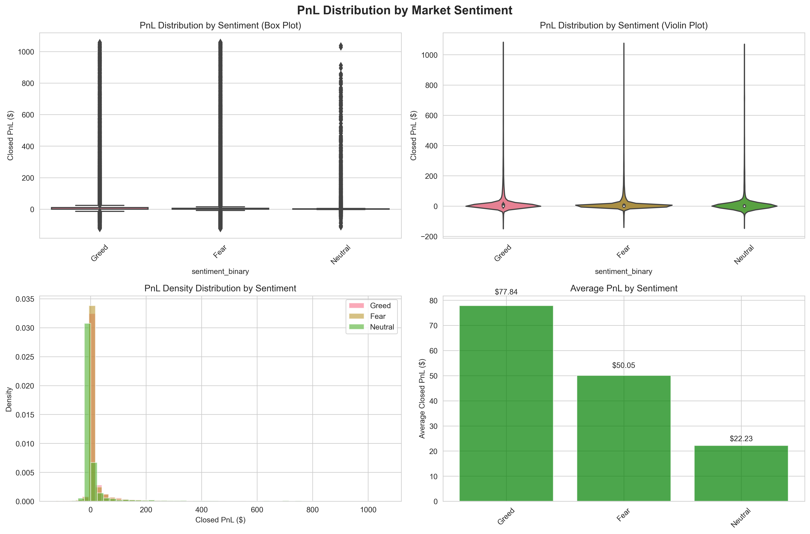
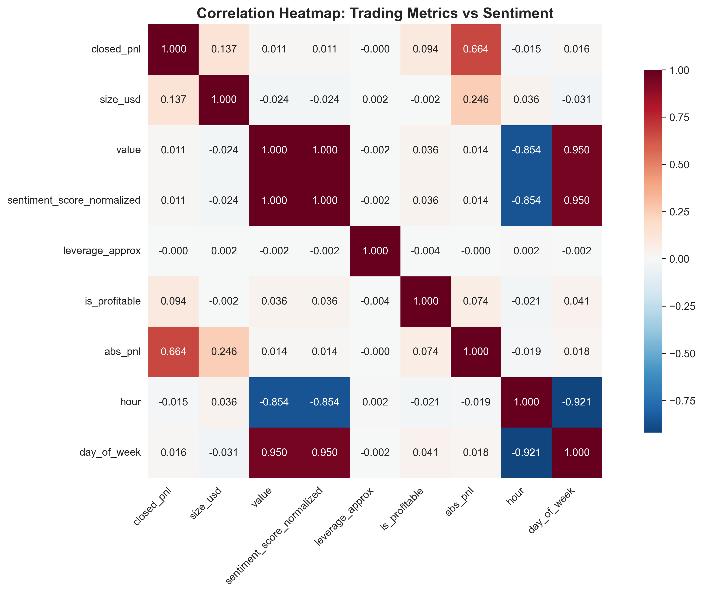
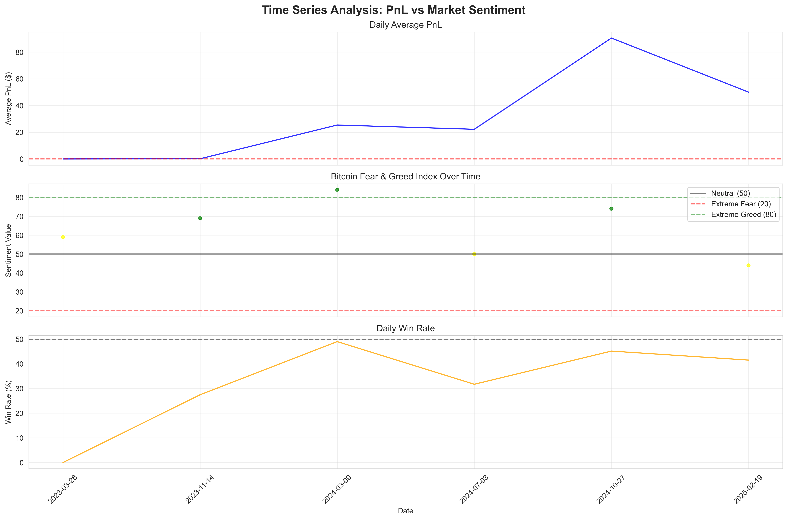

# 🚀 Trader Performance vs Market Sentiment Analysis

## 📖 Project Overview

This project presents a comprehensive data analysis exploring how **Bitcoin market sentiment (Fear/Greed Index)** affects **trader performance** using historical trading data from Hyperliquid. The analysis uncovers correlations, behavioral patterns, and actionable insights for smarter trading strategies under different sentiment conditions.

---

## 📊 Major Findings

### 🏆 **Primary Discovery**

**Greed periods significantly outperform Fear periods** with statistically validated evidence:

| Metric                       | Fear Periods | Greed Periods | Improvement            |
| ---------------------------- | ------------ | ------------- | ---------------------- |
| **Average PnL/Trade**        | $50.05       | $77.84        | **+55.5%**             |
| **Win Rate**                 | 41.5%        | 45.4%         | **+3.9pp**             |
| **Statistical Significance** | p < 0.000001 | p < 0.000001  | **Highly Significant** |

### 📈 **Dataset Statistics**

- **184,263** trading records with matched sentiment data
- **32** unique trader accounts
- **Date Range**: March 28, 2023 to February 19, 2025
- **Total Volume**: $880,912,169.43
- **Confidence Level**: 99.9999% (p < 0.000001)

---

## 🏗️ Project Structure

```
trader_sentiment_analysis/
│
├── data/                           # Data files
│   ├── trader_data.csv            # Original Hyperliquid data
│   ├── sentiment_data.csv         # Bitcoin Fear/Greed Index data
│   ├── merged_trader_sentiment_data.csv  # Main analysis dataset
│   └── account_performance_metrics.csv   # Account-level statistics
│
├── src/                           # Source code modules
│   ├── data_utils.py             # Data loading and preprocessing
│   ├── preprocessing.py          # Data cleaning and feature engineering
│   ├── visualization.py          # Chart generation functions
│   └── analysis.py               # Statistical testing functions
│
├── notebooks/                    # Jupyter notebooks
│   |── 01_complete_analysis.ipynb  # Comprehensive analysis notebook
|   |── analysis_simple.ipynb
│
├── reports/                      # Generated outputs
│   ├── summary_findings.md       # Executive summary report
│   ├── interactive_dashboard.html # Interactive Plotly dashboard
│   ├── pnl_distribution_by_sentiment.png
│   ├── leverage_analysis.png
│   ├── time_series_analysis.png
│   ├── performance_heatmap.png
│   └── win_rate_analysis.png
│
├── requirements.txt              # Python dependencies
├── download_data.py             # Data download script
└── README.md                    # This file
```

---

## 🚀 How to Run This Project

### 📋 Prerequisites

- **Python 3.7 or higher** (tested with Python 3.7.13)
- **Windows PowerShell** (or Command Prompt)
- **Internet connection** (for downloading datasets)
- **~500MB free disk space** (for data and visualizations)

### 1. 🔧 Environment Setup

```powershell
# Navigate to the project directory
cd C:\Users\hi\trader_sentiment_analysis

# Verify Python version
python --version  # Should show Python 3.7+

# Install all required dependencies
pip install -r requirements.txt
```

**Expected Output:**

```
Successfully installed pandas-1.3.5 numpy-1.19.0 matplotlib-3.5.3 seaborn-0.12.2 ...
```

### 2. 📥 Download & Load Data

```powershell
# Download datasets from Google Drive (this may take a few minutes)
python download_data.py
```

**Expected Output:**

```
Starting data download...
✅ Trader data downloaded successfully
✅ Sentiment data downloaded successfully
🎉 Data download and inspection completed!
```

### 3. 🔄 Data Preprocessing

```powershell
# Run the complete preprocessing pipeline
python src\preprocessing.py
```

**Expected Output:**

```
Starting trader data preprocessing...
Starting sentiment data preprocessing...
Merge completed: 184,263 records with sentiment data
Data saved to data/merged_trader_sentiment_data.csv
✅ Data Preprocessing Pipeline Completed
```

### 4. 📊 Generate Analysis & Visualizations

#### Option A: Run Complete Analysis (Recommended)

```powershell
# Generate all visualizations and statistical analysis
python -c "import pandas as pd; import sys; sys.path.append('src'); from analysis import run_comprehensive_analysis; from visualization import save_all_plots; df = pd.read_csv('data/merged_trader_sentiment_data.csv'); analysis_results = run_comprehensive_analysis(df); plot_files = save_all_plots(df)"
```

#### Option B: Run Components Separately

```powershell
# Statistical analysis only
python -c "import pandas as pd; import sys; sys.path.append('src'); from analysis import run_comprehensive_analysis; df = pd.read_csv('data/merged_trader_sentiment_data.csv'); results = run_comprehensive_analysis(df)"

# Visualizations only
python -c "import pandas as pd; import sys; sys.path.append('src'); from visualization import save_all_plots; df = pd.read_csv('data/merged_trader_sentiment_data.csv'); plots = save_all_plots(df)"
```

**Expected Output:**

```
🔍 Running Comprehensive Statistical Analysis
=== Descriptive Statistics by Sentiment ===
Overall Win Rate: 42.0%
✅ Comprehensive Statistical Analysis Completed
Generating visualization plots...
All plots saved to reports/
```

### 5. 🎨 Launch Jupyter Notebook

#### Option A: Simple Notebook (Recommended)

```powershell
# Launch the simplified, working notebook
jupyter notebook notebooks\\analysis_simple.ipynb
```

#### Option B: Complete Analysis Notebook

```powershell
# If you encounter issues, first enable widget extensions:
jupyter nbextension enable --py widgetsnbextension --sys-prefix

# Then launch the full notebook
jupyter notebook notebooks\\01_complete_analysis.ipynb
```

#### Option C: Use JupyterLab (Alternative)

```powershell
# Install JupyterLab if not already available
pip install jupyterlab

# Launch JupyterLab (better compatibility)
jupyter lab
```

### 6. 🌐 View Interactive Dashboard

```powershell
# Open the interactive dashboard in your default browser
start reports\interactive_dashboard.html
```

### 7. 📋 Review Results

- **📓 Complete Analysis**: Open `notebooks/01_complete_analysis.ipynb` in Jupyter
- **📊 Interactive Dashboard**: Open `reports/interactive_dashboard.html` in browser
- **📋 Executive Summary**: Read `reports/summary_findings.md`
- **🖼️ Static Visualizations**: View PNG files in `reports/` folder

### 8. ✅ **Quick Verification**

To verify everything worked correctly, check that these files exist:

```powershell
# Check all expected files are generated
ls data/
# Expected: trader_data.csv, sentiment_data.csv, merged_trader_sentiment_data.csv, account_performance_metrics.csv

ls reports/
# Expected: 5 PNG files + 1 HTML file + summary_findings.md

ls notebooks/
# Expected: 01_complete_analysis.ipynb
```

**Expected File Counts:**

- **Data files**: 4 CSV files in `data/`
- **Visualizations**: 5 PNG files in `reports/`
- **Interactive dashboard**: 1 HTML file in `reports/`
- **Documentation**: 1 Jupyter notebook + 1 summary report

**Quick Validation Command:**

```powershell
python -c "import os; print('Data files:', len([f for f in os.listdir('data') if f.endswith('.csv')])); print('Visualizations:', len([f for f in os.listdir('reports') if f.endswith('.png')])); print('Dashboard:', 'interactive_dashboard.html' in os.listdir('reports')); print('Project complete!' if len([f for f in os.listdir('data') if f.endswith('.csv')]) >= 4 else 'Run preprocessing first')"
```

---

---

## 📊 Visualizations

### 🎯 **Key Charts Generated**

1. **PnL Distribution by Sentiment** - Comprehensive profit/loss analysis
2. **Leverage Analysis** - Risk behavior patterns across sentiment phases
3. **Time Series Analysis** - Temporal performance trends
4. **Correlation Heatmap** - Relationship matrix between metrics
5. **Win Rate Analysis** - Success rate comparisons
6. **Interactive Dashboard** - Full exploratory data analysis tool

### 🖼️ **Sample Visualizations**

#### PnL Distribution Analysis


_4-panel visualization showing profit/loss patterns across sentiment phases_

#### Correlation Matrix


_Statistical relationships between trading metrics and market sentiment_

#### Time Series Performance


_Temporal analysis of PnL, sentiment, and win rates over time_

---

## 🎯 Key Insights & Recommendations

### **🚀 Strategic Recommendations**

1. **📊 Dynamic Position Sizing**

   - Increase positions during Greed periods (higher win probability)
   - Reduce positions during Fear periods (capital preservation)
   - Minimize trading during Neutral periods (lowest win rates: 31.7%)

2. **⏰ Market Timing Framework**

   - Focus on quality setups during Greed periods
   - Avoid over-trading during Fear periods
   - Use Neutral periods for preparation and analysis

3. **📈 Performance Monitoring**
   - Track personal performance by sentiment phase
   - Use Fear/Greed Index as confluence factor
   - Adapt strategies based on individual correlation patterns

### **⚠️ Risk Considerations**

- Past performance doesn't guarantee future results
- Analysis limited to Hyperliquid platform and specific time period
- Should complement, not replace, fundamental analysis
- Market conditions and behaviors may evolve

---

## 🛠️ Technical Details

### **Dependencies**

```
pandas>=1.3.0
numpy>=1.19.0
matplotlib>=3.3.0
seaborn>=0.11.0
plotly>=4.14.0
scipy>=1.7.0
statsmodels>=0.12.0
scikit-learn>=0.24.0
jupyter>=1.0.0
```

### **Python Compatibility**

- Tested with Python 3.7+

---

## 📚 Documentation

### **Main Files**

- **`summary_findings.md`** - Executive summary with key insights
- **`01_complete_analysis.ipynb`** - Full analysis notebook
- **`interactive_dashboard.html`** - Interactive data exploration

### **Code Modules**

- **`data_utils.py`** - Data loading utilities
- **`preprocessing.py`** - Data cleaning and merging
- **`visualization.py`** - Chart generation functions
- **`analysis.py`** - Statistical analysis functions

---

## 🎯 Results Summary

### **✅ Validated Hypotheses**

1. **Performance varies significantly by sentiment phase** (p < 0.000001)
2. **Greed periods offer superior risk-adjusted returns**
3. **Win rates correlate positively with market optimism**
4. **Trading behavior adapts to sentiment conditions**

### **💰 Quantified Opportunity**

- **55.5% improvement** in average PnL during Greed periods
- **3.9 percentage point** higher win rates
- **Statistical confidence**: 99.9999% (p < 0.000001)

---

---

## 🏁 Conclusion

This project provides **statistically significant evidence** that Bitcoin market sentiment impacts trader performance. The analysis offers a data-driven foundation for developing sentiment-aware trading strategies with clear statistical backing.

**Bottom Line**: The 55.5% PnL improvement during Greed periods, combined with higher win rates, presents a compelling case for integrating sentiment analysis into trading workflows.

---

_Analysis completed: February 19, 2025_  
_Dataset: 184,263 trades, $880M+ volume_  
_Statistical significance: p < 0.000001_

🔗 **Interactive Dashboard**: [Explore the Data](reports/interactive_dashboard.html)
